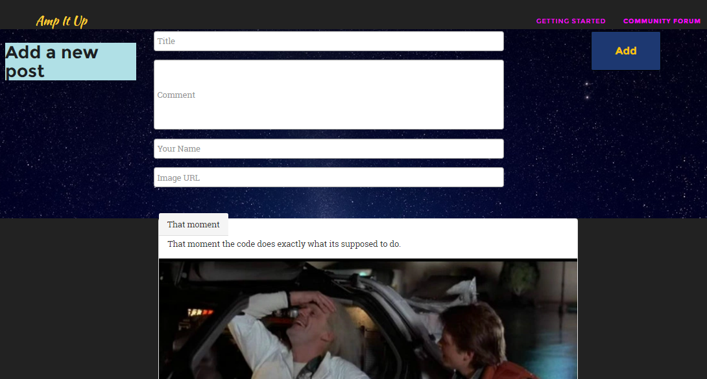
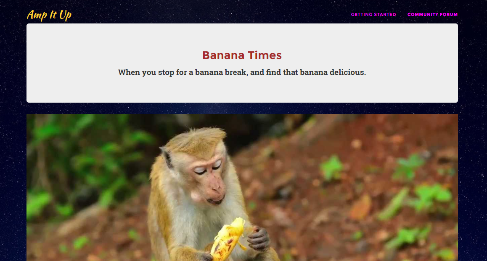
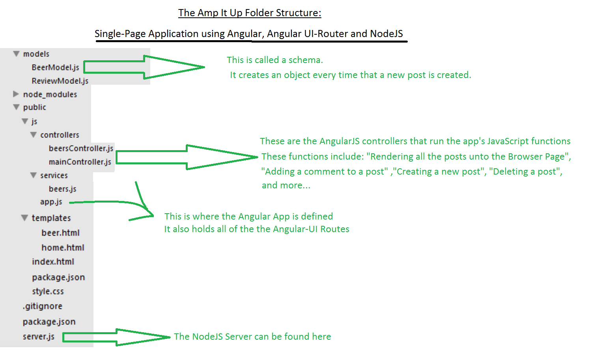

Welcome dear friends to the repo of my Social Network Site.

The app is built with the following technologies:

1 - AngularJS 
2 - NodeJS 
3 - MongoDB 
4 - Mongoose 
5 - Facebook User Authentication 
6 - Deploying to Heroku 
And many more...

Instructions for installing the app on local computer:

Download NodeJS and MongoDB if they're not yet downloaded and installed.

1 - git clone https://github.com/ElishaKay/Social-Network-Site-built-with-JavaScript.git 

2 - npm install 

3 - npm install -g nodemon

4 - nodemon server.js 

5 - navigate to "localhost:8000" in your browser

Here's another Screenshot in case you wanted to see what it looks like when you click on a post:

Service and Controllers:

The project contains the logic and Server-Side code based on another app called "the Beer App".

This is a good example of how AngularJS code can easily be moved from project to project due to its "Seperation of Concerns" architecture.

You can <a href="http://movie-holics.com/blog/mongoisland/index.html" target="_blank"> read more about the Service and Controllers here.</a>
 
That pretty much summarizes most of the main Social Network features.

We will also be covering how to deploy the App to Heroku, and how to install the MongoDB in the cloud (all with free hosting and DB services).

The Meetup where we will be coding this app live will take place in Tel Aviv University, February 7th, 2017, at 7:00PM.

Thanks and enjoy 🤠

